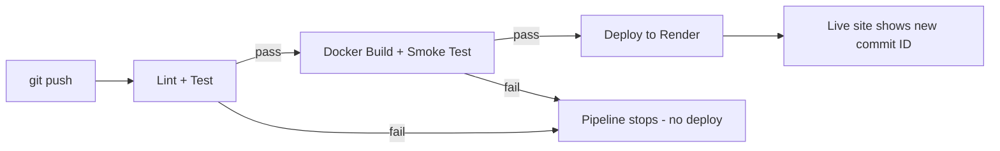

# Financial Services Management System

**Live demo:** https://financial-services-management-system.onrender.com

A small dynamic web application that manages customer **accounts** and a
**deposit/withdrawal ledger**. Pages are generated by the server from
in-memory data, a form changes that data (adds a transaction and updates the
account balance), and the app is tested, linted, containerised, and deployed
automatically through a GitHub Actions CI/CD pipeline.

## Features

- Home page listing all accounts with live balances
- Form to add a deposit or withdrawal (server-side validated: positive
  amount, valid account, sufficient balance for withdrawals)
- Transaction history table, newest first
- JSON API routes: `/api/accounts`, `/api/transactions`
- `/health` route returning `{"status":"ok"}`
- Footer showing the live commit ID (`RENDER_GIT_COMMIT`)
Four seeded demo accounts for quick testing

## Run locally

```bash
npm install
npm run lint
npm test
npm start
# open http://localhost:3000
```

## Run with Docker

```bash
docker build -t fsms .
docker run -p 3000:3000 fsms
```

## Pipeline diagram



## Tech stack

| Component | Choice |
|---|---|
| Language / framework | Node.js 22 + Express |
| Tests | `node:test` (built-in) |
| Lint | ESLint |
| Container | Docker |
| CI/CD | GitHub Actions |
| Hosting | Render |

